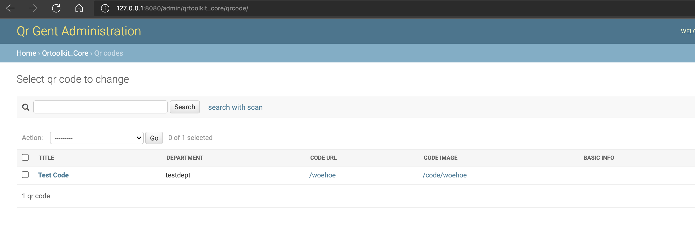
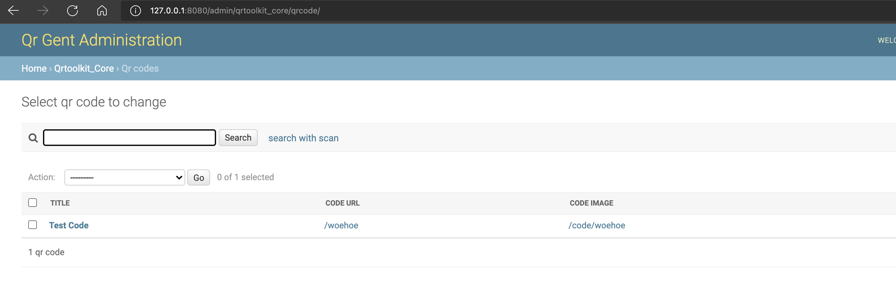

# Theming

## Customizing templates

### setting up your template folder

To setup a template folder where you can override qrtoolkit, or admin panel templates there are 2 simple steps to follow.

1. Create a directory `templates` at the root of your project (where manage.py is located)
2. Add the directory to settings.py in the following manner

```python
TEMPLATES = [
    {
        'BACKEND': 'django.template.backends.django.DjangoTemplates',
        'DIRS': [os.path.join(BASE_DIR, 'templates')], # This is the only line that changes, the other lines you should already have
        'APP_DIRS': True,
        'OPTIONS': {
            'context_processors': [
                'django.template.context_processors.debug',
                'django.template.context_processors.request',
                'django.contrib.auth.context_processors.auth',
                'django.contrib.messages.context_processors.messages',
            ],
        },
    },
]
```

### overriding a template

To override qrtoolkit templates, you should simply create a directory `qrtoolkit_core` in your `templates` directory. This folder should mimic [the structure](https://github.com/lab9k/qrtoolkit-core/tree/master/qrtoolkit_core/templates/qrtoolkit_core) the qrtoolkit_core is using.

- example, override the kiosk template

To override the kiosk template you should have the following directory structure

```
.
├── db.sqlite3
├── manage.py
├── myqrtoolkit
│   ├── __init__.py
│   ├── asgi.py
│   ├── settings.py
│   ├── urls.py
│   └── wsgi.py
└── templates
    └── qrtoolkit_core
        └── qrcode
            └── kiosk.html # This is the template you should create
```

Add in the default content, which you can find on github, or in your installed python packages.

`kiosk.html`



```django
 
    <div class="container">
        <h1 class="text-center mt-3">{{ qrcode.title }}</h1>
        <div class="row">
            
                <div class="col-6 text-center mt-3">
                    <a
                            class="btn btn-info btn-lg btn-block text-dark btn-rnd"
                            href="{{ url.url }}"
                            role="button"
                    >{{ url.name }}</a>
                </div>
            
        </div>
        <ul></ul>
    </div>

```



Update the contents of the file. As an example, you can change the `btn-info` class on the button (<a\> tag) to `btn-warning`.

Now the buttons in a kiosk qr code will have an orange color!

## Custom admin panel

The default list view for qr codes in the django admin is the following (i created 1 qr code as an example):



If you want this list to look differently, but still contain the core functionality, you can use the steps below

### unregister the qrtoolkit_core admin models

in the file `mycustomapp/admin.py` you have created in [the getting started tutorial](getting_started.md).

```python
from qrtoolkit_core import models as qr_models
from qrtoolkit_core.admin import QRCodeAdmin

admin.site.unregister(qr_models.QRCode)
```

### Create your own admin model and register it

in the file `mycustomapp/admin.py`

```python
# Make sure this is written AFTER the previous step
@admin.register(qr_models.QRCode)
class MyQrCodeAdmin(QRCodeAdmin):
    # Here you can override the fields you want to customize
    list_display = ('title', 'get_code_url', 'get_code_image_url')
```

Now the qr code list will look like the following:



For more documentation about what fields you can override here, have a look at [the official django documentation](https://docs.djangoproject.com/en/3.0/ref/contrib/admin/)
